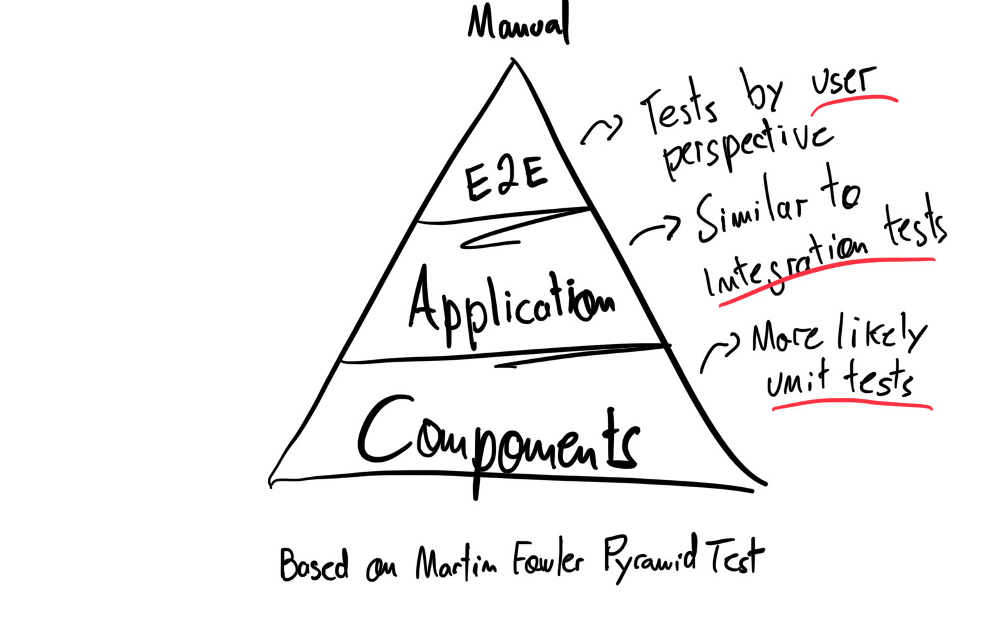

In the long of my coding experience, I notice that some colleagues struggle to make test in front end. Sometimes is about not being familiar, Or about the details of a specific framework. But sometimes is to **know about what you should be covered**. Some books (good books) even describe it as hard to do, saying that is not a good idea. But we are in 2021, and the testing tools evolved to make good test of a UI in front end.

In this article, I cover common types of testing, an overall view of these types and examples of tools that you can use to make it work.

## Disclaimer
First things first. By reading this article, I expected that you know the basics of testing and have some experiences doing that. **If you don't know anything about testing, this article is not for you**. 

That being said, Let's go!

## Pyramid of testing

You probably know this particular pyramid of testing. This is originally from [Martin Fowler article about testing in Software Engineering](https://martinfowler.com/articles/practical-test-pyramid.html).

Another one is [The Testing Trophy](https://twitter.com/kentcdodds/status/960723172591992832?lang=es), from Kent C Dodds, and gives another perspective from the same subject.

What I going to present here is based on Martin Fowler Pyramid of Testing with some little changes to represent **more general perspective of testing in front end**. Looks like this:

These boundaries in the pyramid is what I call **levels** in this article. Each level represent a different purpose of testing. These levels can have different **types** of tests. Define tests types can be fuzzy and difficult because sometimes we don't have a good separation in the code. 

Keep in mind that what I am presenting here is based on **common problems** that we want to solve in developing UI (specially web applications). But **you don't need to have it all** in your codebase, you always need to identify what are them you need before putting into your project.

That being said, let's start with the most common levels and types

### Component level

Nowadays, it is common to use a component approach. We start creating components that have tiny pieces of our layout, and then we stitch together to create a whole page. Using that as a principle we can have some levels of testing.  
In this level we test what we are going to use in the components code. Ideally our components are decoupled from the rest of the code. So we can test it independently, to work with whatever input.

#### Snapshots test

We are usually not using raw HTML to create our code. React, Vue and Angular come to rescue. So the first test that you want to have in our codebase is snapshot testing. With that test we can assure that the component made in React for example is rendering the same output in HTML as should be in the browser.

Test framework of these components libraries have a way to render the actual HTML, and then you can save it using a snapshot tool. [Jest has a documentation](https://jestjs.io/docs/snapshot-testing) to do that.

#### Interaction test

Web applications are made by interactions, and our components have methods that can be called by the interaction of an user. If a user clicks in a button and opens a dropdown, you want to test if that interactions is working as expected and open the dropdown correctly. Usually the test frameworks have a way to test that too an example of amazing tool is the [testing-library](https://testing-library.com/docs/).

#### Visual regression

The UI is made by pixels. You want to make sure that the visual of the components that you write is not changing when you do a refactor. With visual regression test you can take care of that by taking a screenshot of the component inside a screen and compare it with the previous version. Sometimes can be tricky, like with animations, with different OS, different browsers, different screen resolutions, etc. But generally it is a good idea to have it in your codebase in some level.

To make that test you need to put your component in a real browser and take a screenshot of it. So you need something emulating the component in browser and. You can do that with [Cypress](https://www.cypress.io/), [Playwright](https://playwright.dev/), [Storybook](https://storybook.js.org/) with [Loki](https://loki.js.org/) or [Chromatic](https://www.chromatic.com/).

### Application level

#### Functional test

Classic functional testing, you can use to test functions, helpers, data layer and etc.

#### Integration test

You can use the term integration test to describe these tests by building the entire application, serve and try to execute some main happy scenarios mocking external services. You can do that easily with some testing tools like [Cypress](https://www.cypress.io/), [Playwright](https://playwright.dev/), etc.

### End-to-End test

You can see this as feature test by testing our application by a user perspective. This test is fragile and can be hard to do, but it is a good way to test the application. You can do it with the same tools from the application level.

## Conclusion

I hope by knowing some different types of testing and levels of testing may help you to make good decisions of what tests do you need in your codebase. Although, **which and how is up to you and your team. Just not forget to test, your future self will thank you**.

## References

Some references and further study about testing and front end architecture. Make a good use:

- [ARTICLE: Practical Test Pyramid by *Martin Fowler*](https://martinfowler.com/articles/practical-test-pyramid.html)
- [ARTICLE: Unit test by *Martin Fowler*](https://martinfowler.com/bliki/UnitTest.html)
- [ARTICLE: Gherkin Language by *Cucumber*](https://cucumber.io/docs/gherkin/)
- [ARTICLE: Atomic Design by *Brad Frost*](https://bradfrost.com/blog/post/atomic-web-design/)
- [BOOK: Clean Code by *Martin Robert C.*](https://www.amazon.com.br/dp/B001GSTOAM/ref=dp-kindle-redirect?_encoding=UTF8&btkr=1)
